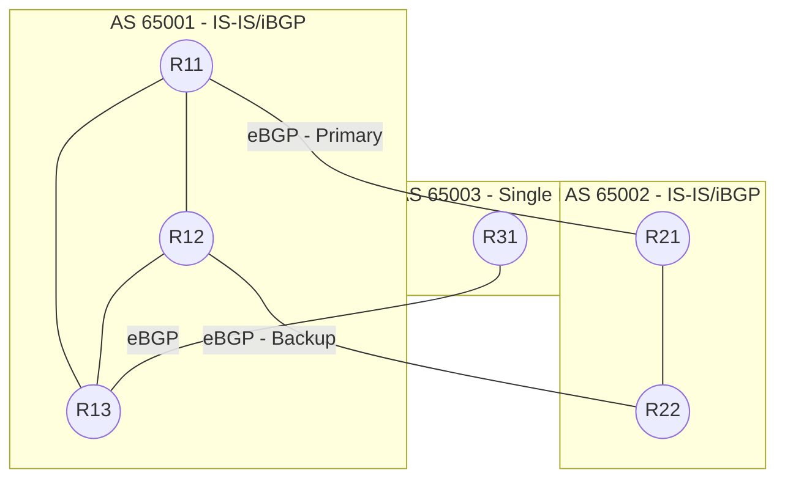

# Automated Network Lab & Observability Stack

This repository contains two linked portfolio projects demonstrating advanced Network Production Engineering skills:
1. **Project 1: Automated Network Lab** - A multi-AS BGP/IS-IS network lab built with `containerlab`, `FRRouting`, and a custom Python automation toolchain.
2. **Project 2: Observability Stack** - A Prometheus and Grafana monitoring stack hooked into the routers via sidecar exporters, complete with Alertmanager rules for BGP session drops and high CPU.

## Topology Diagram



## Quickstart

**Requirements:** Linux host (or WSL2/VM) with Docker, `containerlab`, and `docker-compose` installed.

1. **Launch the Network Lab (Project 1)**
   ```bash
   make up
   ```
   This deploys the containerlab topology including the exporter sidecars.

2. **Deploy the Configurations**
   ```bash
   make deploy
   ```
   This reads `topology/intent.yml`, generates Jinja2 configs, and pushes them to the routers idempotently using FRR reload scripts.

3. **Verify Adjacencies**
   ```bash
   make verify
   ```
   Runs a Python script that asserts all IS-IS adjacencies and BGP sessions are `Established` via FRR JSON outputs.

4. **Launch the Monitoring Stack (Project 2)**
   ```bash
   make monitoring-up
   ```
   Deploys Prometheus (port 9090), Alertmanager (port 9093), and Grafana (port 3000) using docker-compose. Dashboards are automatically provisioned.

To tear down the entire environment:
```bash
make clean
```

## How to change the intent (Infrastructure as Code)
1. Edit `topology/intent.yml` (the single source of truth).
2. Run `python3 automation/generate.py` to update the FRR templates and the Containerlab topology.
3. Run `make deploy` to push the configurations to the running lab.

## Unit and Integration Tests
To run the Python unit tests for the Pydantic schema validation and automation scripts:
```bash
make test
```
*Note: `test_integration.py` will skip automatically if Docker is not available in your environment.*
